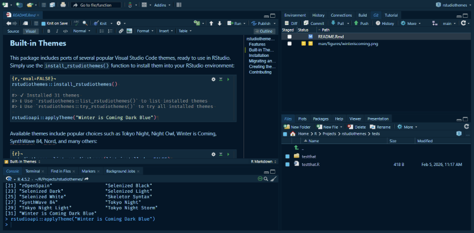
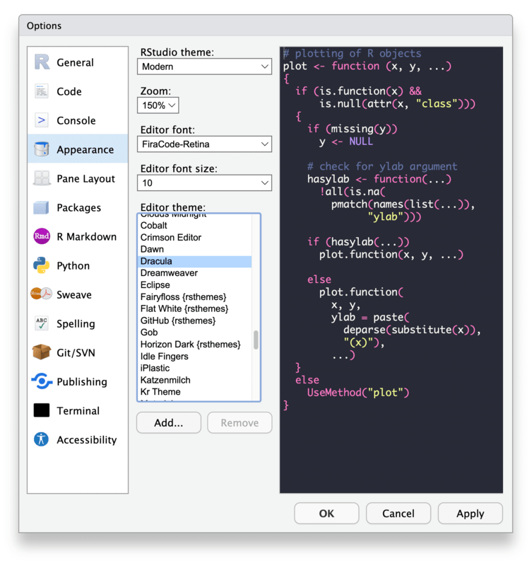

<!-- README.md is generated from README.Rmd. Please edit that file -->

# rstudiothemes <a href="https://dieghernan.github.io/rstudiothemes/"></a>

<!-- badges: start -->

[](https://github.com/dieghernan/rstudiothemes/actions/workflows/check-full.yaml)
[](https://github.com/dieghernan/rstudiothemes/actions/workflows/rhub.yaml)
[](https://app.codecov.io/gh/dieghernan/rstudiothemes)
[](https://www.codefactor.io/repository/github/dieghernan/rstudiothemes)
[](https://dieghernan.r-universe.dev/rstudiothemes)

<!-- badges: end -->

Convert **Visual Studio Code** and **TextMate** themes into **RStudio**
custom themes.

This package provides tools to easily convert Visual Studio Code and
TextMate theme files (`.json` and `.tmTheme` formats) into
RStudio-compatible `.rstheme` files. RStudio has supported custom themes
in `.rstheme` format since [version
1.2+](https://rstudio.github.io/rstudio-extensions/rstudio-theme-creation.html).

## Features

- Convert Visual Studio Code and TextMate themes into RStudio `.rstheme`
  format.
- Bidirectional conversion between Visual Studio Code and TextMate
  themes.
- Organize and manage custom themes in a reproducible way.
- Integrates with R tooling for easier installation and testing.
- Includes ports of popular Visual Studio Code themes ready to use in
  RStudio.

## Built-in Themes

This package includes ports of several popular Visual Studio Code
themes, ready to use in RStudio. Simply use the
`install_rstudiothemes()` function to install them into your RStudio
environment:

``` r
rstudiothemes::install_rstudiothemes()

#> ✔ Installed 27 themes
#> ℹ Use `rstudiothemes::list_rstudiothemes()` to list installed themes
#> ℹ Use `rstudiothemes::try_rstudiothemes()` to try all installed themes

rstudioapi::applyTheme("Winter is Coming Dark Blue")
```

<figure>

<figcaption aria-hidden="true">Screenshot of theme Winter is Coming Dark
Blue</figcaption>
</figure>

Available themes include popular choices such as Tokyo Night, Night Owl,
Winter is Coming, SynthWave 84, Nord, and many others:

``` r
rstudiothemes::list_rstudiothemes(list_installed = FALSE)
#>  [1] "ayu Dark"                   "ayu Light"                 
#>  [3] "cobalt2"                    "CRAN"                      
#>  [5] "Dracula2025"                "GitHub Dark"               
#>  [7] "GitHub Light"               "JellyFish Theme"           
#>  [9] "Matrix"                     "Night Owl"                 
#> [11] "Night Owl Light"            "Nord"                      
#> [13] "OKSolar Dark"               "OKSolar Light"             
#> [15] "OKSolar Sky"                "Overflow Dark"             
#> [17] "Overflow Light"             "Panda Syntax"              
#> [19] "Selenized Dark"             "Selenized Light"           
#> [21] "Skeletor Syntax"            "SynthWave 84"              
#> [23] "Tokyo Night"                "Tokyo Night Light"         
#> [25] "Tokyo Night Storm"          "Winter is Coming Dark Blue"
#> [27] "Winter is Coming Light"
```

We also distribute all our themes in a single `.zip` file at
<https://dieghernan.github.io/rstudiothemes/dist/rstudiothemes.zip>.
Unzip and install using the [RStudio IDE
interface](https://support.posit.co/hc/en-us/articles/115011846747-Using-Themes-in-the-RStudio-IDE).

## Installation

You can install **rstudiothemes** using either of these methods:

``` r
# install.packages("pak")
pak::pak("dieghernan/rstudiothemes")
```

Or, install it from r-universe:

``` r
# Install rstudiothemes in R:
install.packages(
  "rstudiothemes",
  repos = c(
    "https://dieghernan.r-universe.dev",
    "https://cloud.r-project.org"
  )
)
```

## Migrating an existing theme

You can convert any Visual Studio Code or TextMate theme to RStudio
format. Here’s how:

1.  Use your favorite Visual Studio Code or TextMate theme file or the
    URL of an online theme.
2.  Use the `convert_to_rstudio_theme()` function to convert and install
    it:

``` r
rstudiothemes::convert_to_rstudio_theme("<path/to/file>", apply = TRUE, force = TRUE)
```

Alternatively, install the `.rstheme` file via the RStudio UI:

**Tools → Global Options → Appearance**

<figure>

<figcaption aria-hidden="true">Example on how to update themes on
RStudio IDE</figcaption>
</figure>

### Bidirectional conversion Visual Studio Code - TextMate

The package also includes the conversion functions
`convert_vs_to_tm_theme()` and `convert_tm_to_vs_theme()`, allowing you
to convert themes in both directions if needed.

## Creating themes from scratch

**rstudiothemes** does not provide a built-in theme editor, but you can
create your own themes from scratch using the following tools:

- TextMate `.tmTheme`: <https://tmtheme-editor.linuxbox.ninja/>. Also
  see the official RStudio documentation on [creating
  themes](https://rstudio.github.io/rstudio-extensions/rstudio-theme-creation.html).
- Visual Studio Code `.json`: See the official documentation on
  [creating color
  themes](https://code.visualstudio.com/api/extension-guides/color-theme).

## Contributing

Contributions are welcome! To contribute to this project:

1.  Open an issue to discuss your ideas or proposed changes.
2.  Fork the repository and create a feature branch.
3.  Submit a pull request with clear commit messages and descriptions.
