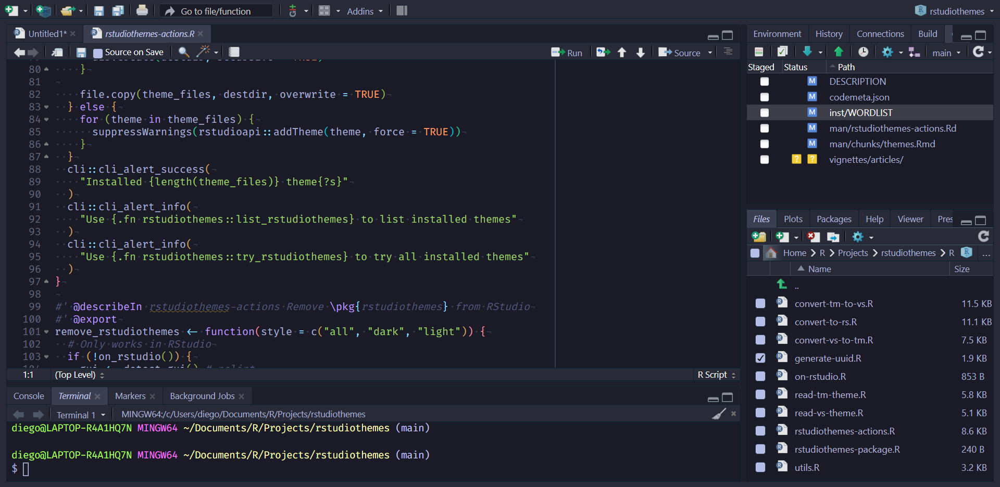

# Showcase

Showcase of bundled themes in **rstudiothemes**.

We also distribute all our themes in a single `.zip` file at
<https://dieghernan.github.io/rstudiothemes/dist/rstudiothemes.zip>.
Unzip and install using the [RStudio IDE
interface](https://support.posit.co/hc/en-us/articles/115011846747-Using-Themes-in-the-RStudio-IDE).

*Click the image to enlarge*

##### ayu Dark

##### ayu Light

##### Catppuccin Latte

##### Catppuccin Mocha

##### cobalt2

##### CRAN

##### Dracula2025

##### GitHub Dark

##### GitHub Light

##### JellyFish Theme

##### Matcha

##### Matrix

##### Night Owl

##### Night Owl Light

##### Nord

##### OKSolar Dark

##### OKSolar Light

##### OKSolar Sky

##### Overflow Dark

##### Overflow Light

##### Panda Syntax

##### Selenized Dark

##### Selenized Light

##### Skeletor Syntax

##### SynthWave 84

##### Tokyo Night

##### Tokyo Night Light

##### Tokyo Night Storm

##### Winter is Coming Dark Blue

##### Winter is Coming Light
