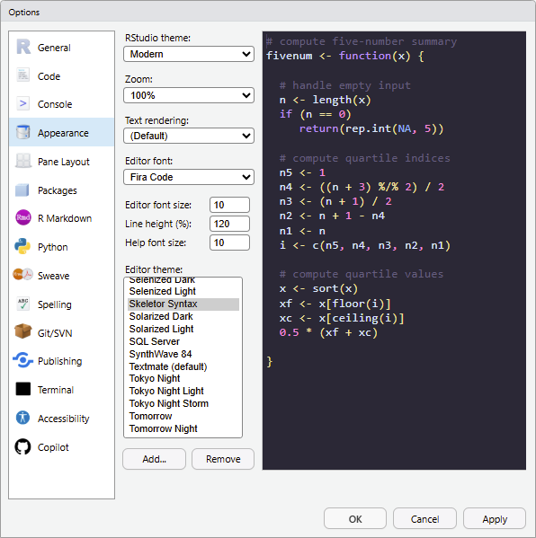
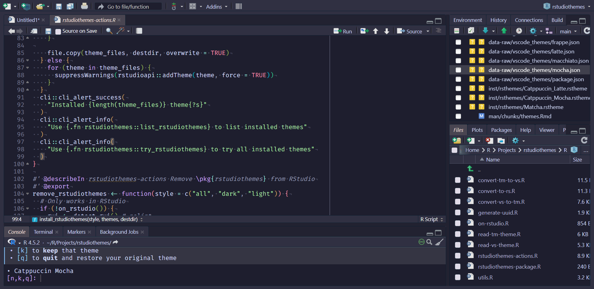
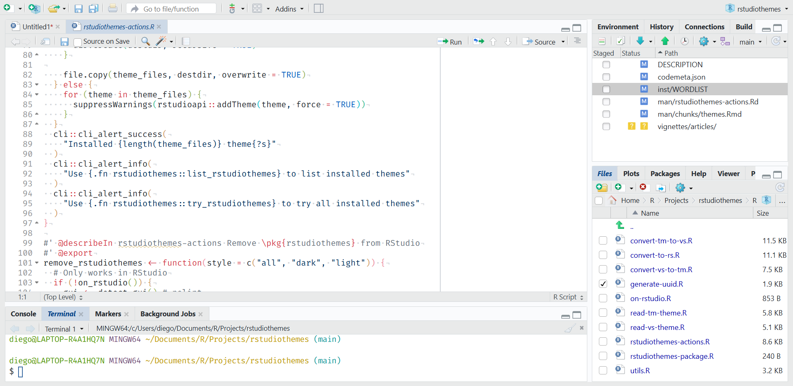
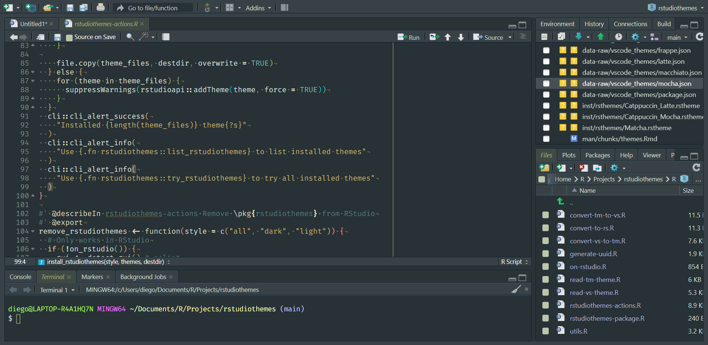
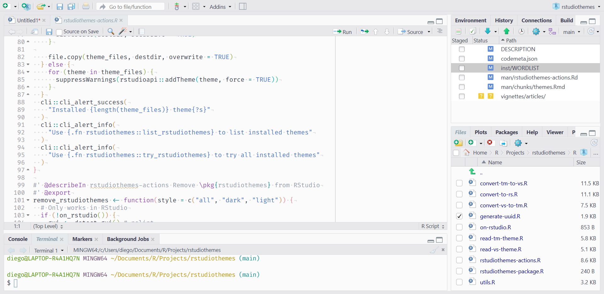
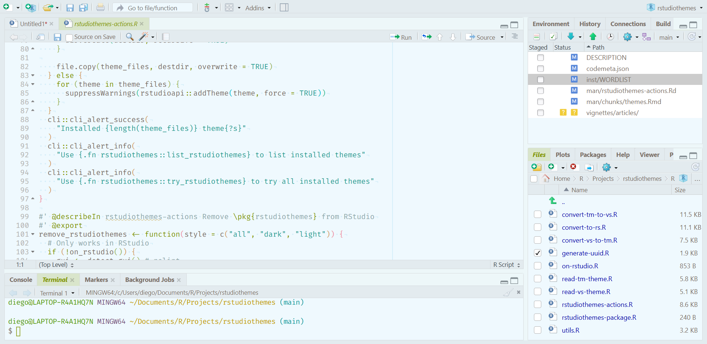
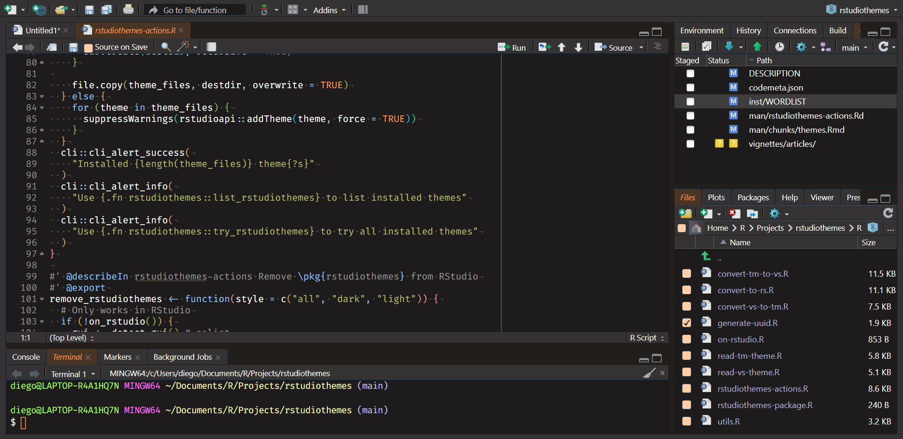
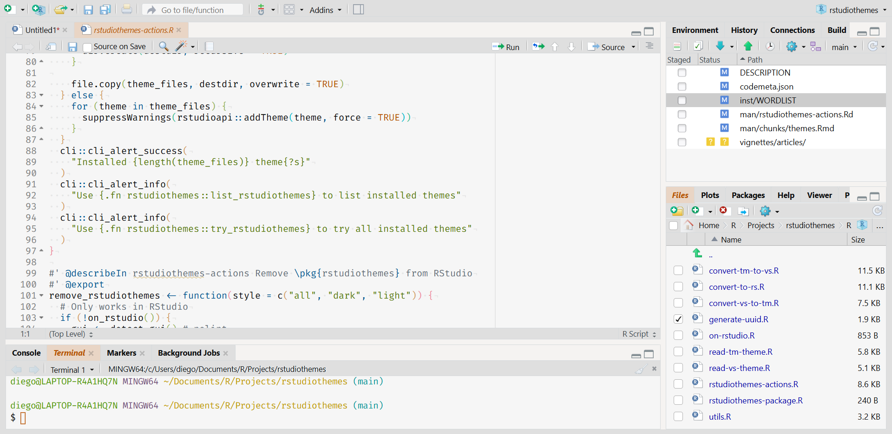
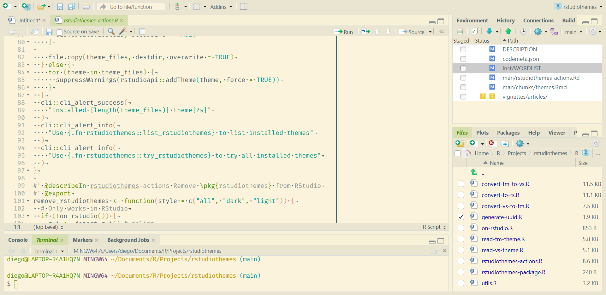
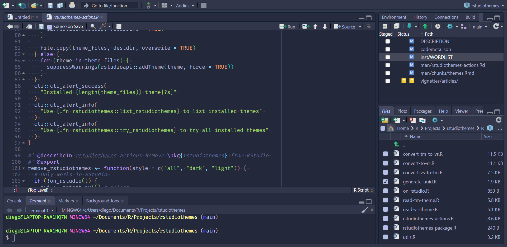

# Showcase

Showcase of bundled themes in **rstudiothemes**.

You can installed them with:

``` r
rstudiothemes::install_rstudiothemes()
```

We also distribute all our themes in a single `.zip` file
[dist/rstudiothemes.zip](https://dieghernan.github.io/rstudiothemes/dist/rstudiothemes.zip).
Unzip and install using the [RStudio IDE
interface](https://docs.posit.co/ide/user/ide/guide/ui/appearance.html).

**Tools \> Global Options \> Appearance \> Add**



## Lightbox Gallery

Click the images to enlarge.

[](https://dieghernan.github.io/rstudiothemes/dev/articles/screenshots/ayudark.png)

##### ayu Dark

[](https://dieghernan.github.io/rstudiothemes/dev/articles/screenshots/ayulight.png)

##### ayu Light

[](https://dieghernan.github.io/rstudiothemes/dev/articles/screenshots/catppuccinlatte.png)

##### Catppuccin Latte

[](https://dieghernan.github.io/rstudiothemes/dev/articles/screenshots/catppuccinmocha.png)

##### Catppuccin Mocha

[](https://dieghernan.github.io/rstudiothemes/dev/articles/screenshots/cobalt2.png)

##### cobalt2

[](https://dieghernan.github.io/rstudiothemes/dev/articles/screenshots/cran.png)

##### CRAN

[](https://dieghernan.github.io/rstudiothemes/dev/articles/screenshots/dracula2025.png)

##### Dracula2025

[](https://dieghernan.github.io/rstudiothemes/dev/articles/screenshots/githubdark.png)

##### GitHub Dark

[](https://dieghernan.github.io/rstudiothemes/dev/articles/screenshots/githublight.png)

##### GitHub Light

[](https://dieghernan.github.io/rstudiothemes/dev/articles/screenshots/jellyfishtheme.png)

##### JellyFish Theme

[](https://dieghernan.github.io/rstudiothemes/dev/articles/screenshots/matcha.png)

##### Matcha

[](https://dieghernan.github.io/rstudiothemes/dev/articles/screenshots/matrix.png)

##### Matrix

[](https://dieghernan.github.io/rstudiothemes/dev/articles/screenshots/nightowl.png)

##### Night Owl

[](https://dieghernan.github.io/rstudiothemes/dev/articles/screenshots/nightowllight.png)

##### Night Owl Light

[](https://dieghernan.github.io/rstudiothemes/dev/articles/screenshots/nord.png)

##### Nord

[](https://dieghernan.github.io/rstudiothemes/dev/articles/screenshots/oksolardark.png)

##### OKSolar Dark

[](https://dieghernan.github.io/rstudiothemes/dev/articles/screenshots/oksolarlight.png)

##### OKSolar Light

[](https://dieghernan.github.io/rstudiothemes/dev/articles/screenshots/oksolarsky.png)

##### OKSolar Sky

[](https://dieghernan.github.io/rstudiothemes/dev/articles/screenshots/overflowdark.png)

##### Overflow Dark

[](https://dieghernan.github.io/rstudiothemes/dev/articles/screenshots/overflowlight.png)

##### Overflow Light

[](https://dieghernan.github.io/rstudiothemes/dev/articles/screenshots/pandasyntax.png)

##### Panda Syntax

[](https://dieghernan.github.io/rstudiothemes/dev/articles/screenshots/selenizeddark.png)

##### Selenized Dark

[](https://dieghernan.github.io/rstudiothemes/dev/articles/screenshots/selenizedlight.png)

##### Selenized Light

[](https://dieghernan.github.io/rstudiothemes/dev/articles/screenshots/skeletorsyntax.png)

##### Skeletor Syntax

[](https://dieghernan.github.io/rstudiothemes/dev/articles/screenshots/synthwave84.png)

##### SynthWave 84

[](https://dieghernan.github.io/rstudiothemes/dev/articles/screenshots/tokyonightlight.png)

##### Tokyo Night Light

[](https://dieghernan.github.io/rstudiothemes/dev/articles/screenshots/tokyonightstorm.png)

##### Tokyo Night Storm

[](https://dieghernan.github.io/rstudiothemes/dev/articles/screenshots/tokyonight.png)

##### Tokyo Night

[](https://dieghernan.github.io/rstudiothemes/dev/articles/screenshots/winteriscomingdarkblue.png)

##### Winter is Coming Dark Blue

[](https://dieghernan.github.io/rstudiothemes/dev/articles/screenshots/winteriscominglight.png)

##### Winter is Coming Light

ayu Dark

ayu Light

Catppuccin Latte

Catppuccin Mocha

cobalt2

CRAN

Dracula2025

GitHub Dark

GitHub Light

JellyFish Theme

Matcha

Matrix

Night Owl

Night Owl Light

Nord

OKSolar Dark

OKSolar Light

OKSolar Sky

Overflow Dark

Overflow Light

Panda Syntax

Selenized Dark

Selenized Light

Skeletor Syntax

SynthWave 84

Tokyo Night Light

Tokyo Night Storm

Tokyo Night

Winter is Coming Dark Blue

Winter is Coming Light
