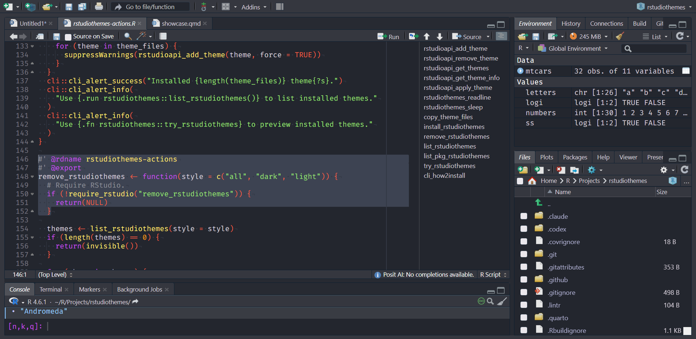
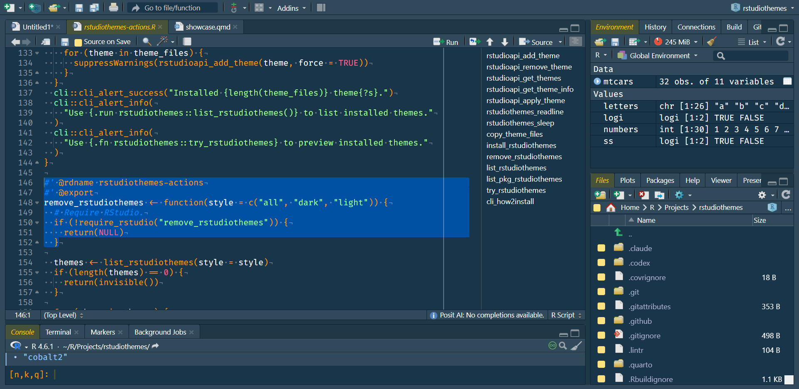
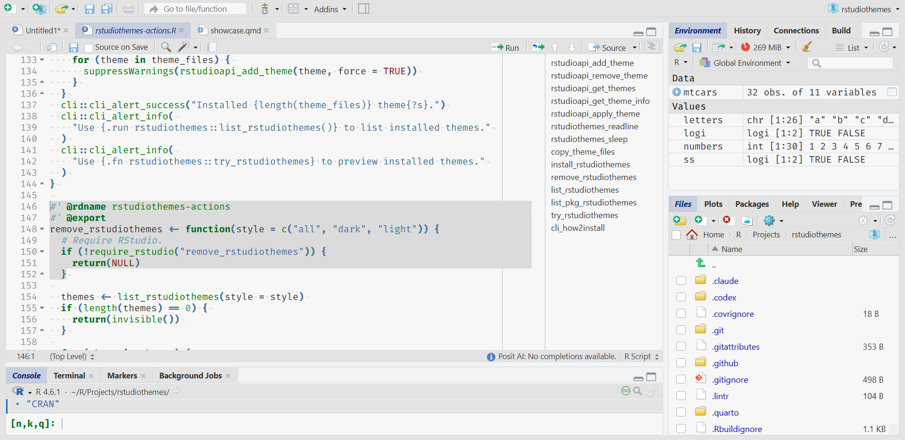
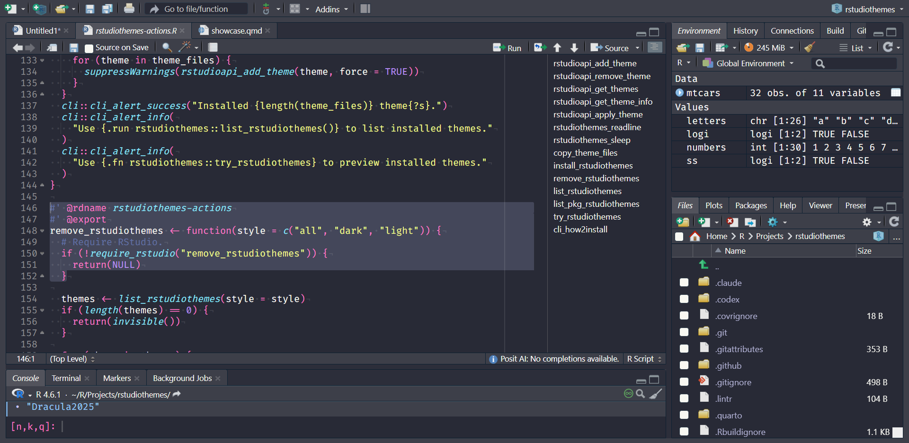
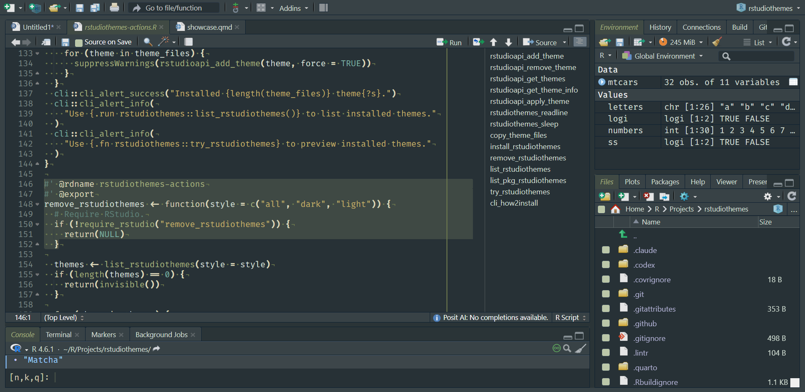
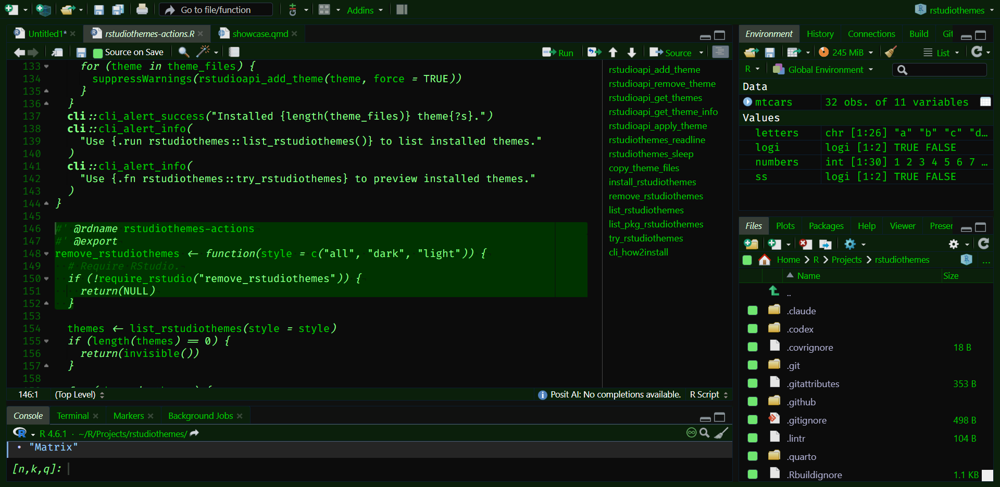
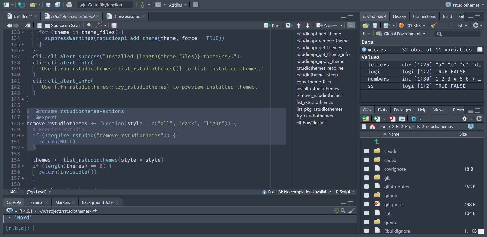

# Theme gallery

This article previews bundled **RStudio** themes from **rstudiothemes**.

Install the bundled themes with:

``` r

rstudiothemes::install_rstudiothemes()
```

The bundled themes are also distributed in a single `.zip` file:
[dist/rstudiothemes.zip](https://dieghernan.github.io/rstudiothemes/dist/rstudiothemes.zip).
Unzip the file and install the themes using the [**RStudio** IDE
interface](https://docs.posit.co/ide/user/ide/guide/ui/appearance.html).

In **RStudio**, choose `Tools > Global Options > Appearance > Add`.


Figure 1: **RStudio** Add Theme interface.

## Lightbox gallery

Click an image to enlarge it.

[](https://dieghernan.github.io/rstudiothemes/dev/articles/screenshots/andromeda.png)

Andromeda

[](https://dieghernan.github.io/rstudiothemes/dev/articles/screenshots/ayudark.png)

ayu Dark

[](https://dieghernan.github.io/rstudiothemes/dev/articles/screenshots/ayulight.png)

ayu Light

[](https://dieghernan.github.io/rstudiothemes/dev/articles/screenshots/barbietheme.png)

Barbie Theme

[](https://dieghernan.github.io/rstudiothemes/dev/articles/screenshots/blulocolight.png)

Bluloco Light

[](https://dieghernan.github.io/rstudiothemes/dev/articles/screenshots/catppuccinlatte.png)

Catppuccin Latte

[](https://dieghernan.github.io/rstudiothemes/dev/articles/screenshots/catppuccinmocha.png)

Catppuccin Mocha

[](https://dieghernan.github.io/rstudiothemes/dev/articles/screenshots/cobalt2.png)

cobalt2

[](https://dieghernan.github.io/rstudiothemes/dev/articles/screenshots/cran.png)

CRAN

[](https://dieghernan.github.io/rstudiothemes/dev/articles/screenshots/dracula2025.png)

Dracula2025

[](https://dieghernan.github.io/rstudiothemes/dev/articles/screenshots/githubdark.png)

GitHub Dark

[](https://dieghernan.github.io/rstudiothemes/dev/articles/screenshots/githublight.png)

GitHub Light

[](https://dieghernan.github.io/rstudiothemes/dev/articles/screenshots/jellyfishtheme.png)

JellyFish Theme

[](https://dieghernan.github.io/rstudiothemes/dev/articles/screenshots/matcha.png)

Matcha

[](https://dieghernan.github.io/rstudiothemes/dev/articles/screenshots/matrix.png)

Matrix

[](https://dieghernan.github.io/rstudiothemes/dev/articles/screenshots/nightowl.png)

Night Owl

[](https://dieghernan.github.io/rstudiothemes/dev/articles/screenshots/nightowllight.png)

Night Owl Light

[](https://dieghernan.github.io/rstudiothemes/dev/articles/screenshots/nord.png)

Nord

[](https://dieghernan.github.io/rstudiothemes/dev/articles/screenshots/oksolardark.png)

OKSolar Dark

[](https://dieghernan.github.io/rstudiothemes/dev/articles/screenshots/oksolarlight.png)

OKSolar Light

[](https://dieghernan.github.io/rstudiothemes/dev/articles/screenshots/oksolarsky.png)

OKSolar Sky

[](https://dieghernan.github.io/rstudiothemes/dev/articles/screenshots/onedarkpro.png)

One Dark Pro

[](https://dieghernan.github.io/rstudiothemes/dev/articles/screenshots/overflowdark.png)

Overflow Dark

[](https://dieghernan.github.io/rstudiothemes/dev/articles/screenshots/overflowlight.png)

Overflow Light

[](https://dieghernan.github.io/rstudiothemes/dev/articles/screenshots/pandasyntax.png)

Panda Syntax

[](https://dieghernan.github.io/rstudiothemes/dev/articles/screenshots/positrondark.png)

Positron Dark

[](https://dieghernan.github.io/rstudiothemes/dev/articles/screenshots/positronlight.png)

Positron Light

[](https://dieghernan.github.io/rstudiothemes/dev/articles/screenshots/selenizeddark.png)

Selenized Dark

[](https://dieghernan.github.io/rstudiothemes/dev/articles/screenshots/selenizedlight.png)

Selenized Light

[](https://dieghernan.github.io/rstudiothemes/dev/articles/screenshots/skeletorsyntax.png)

Skeletor Syntax

[](https://dieghernan.github.io/rstudiothemes/dev/articles/screenshots/synthwave84.png)

SynthWave 84

[](https://dieghernan.github.io/rstudiothemes/dev/articles/screenshots/tokyonight.png)

Tokyo Night

[](https://dieghernan.github.io/rstudiothemes/dev/articles/screenshots/tokyonightlight.png)

Tokyo Night Light

[](https://dieghernan.github.io/rstudiothemes/dev/articles/screenshots/tokyonightstorm.png)

Tokyo Night Storm

[](https://dieghernan.github.io/rstudiothemes/dev/articles/screenshots/vscodedark.png)

VSCode Dark

[](https://dieghernan.github.io/rstudiothemes/dev/articles/screenshots/vscodelight.png)

VSCode Light

[](https://dieghernan.github.io/rstudiothemes/dev/articles/screenshots/winteriscomingdarkblue.png)

Winter is Coming Dark Blue

[](https://dieghernan.github.io/rstudiothemes/dev/articles/screenshots/winteriscominglight.png)

Winter is Coming Light

About the screenshots

Previews may look different on your device. The screenshots use this
setup:

**RStudio** version

    RStudio 2026.08.1+195 "Yellow Yarrow"

    Release (8d474bc4cfad0e317095cd171e8ef44db6887068, 2026-08-14) for windows
    Mozilla/5.0 (Windows NT 10.0; Win64; x64) AppleWebKit/537.36 (KHTML, like Gecko)
    RStudio/2026.08.1+195
    Chrome/148.0.7778.280
    Electron/42.7.1
    Safari/537.36,
    Quarto 1.10.18 (C:/Users/diego/AppData/Local/Programs/Quarto/bin/quarto.exe)

**Code font**

Fira Code: <https://fonts.google.com/specimen/Fira+Code>.


Figure 2: **RStudio** options used for screenshots.

Andromeda

ayu Dark

ayu Light

Barbie Theme

Bluloco Light

Catppuccin Latte

Catppuccin Mocha

cobalt2

CRAN

Dracula2025

GitHub Dark

GitHub Light

JellyFish Theme

Matcha

Matrix

Night Owl

Night Owl Light

Nord

OKSolar Dark

OKSolar Light

OKSolar Sky

One Dark Pro

Overflow Dark

Overflow Light

Panda Syntax

Positron Dark

Positron Light

Selenized Dark

Selenized Light

Skeletor Syntax

SynthWave 84

Tokyo Night

Tokyo Night Light

Tokyo Night Storm

VSCode Dark

VSCode Light

Winter is Coming Dark Blue

Winter is Coming Light
