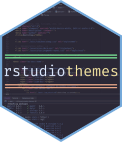
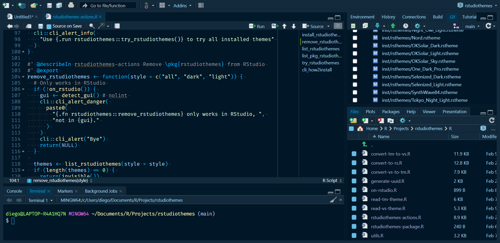
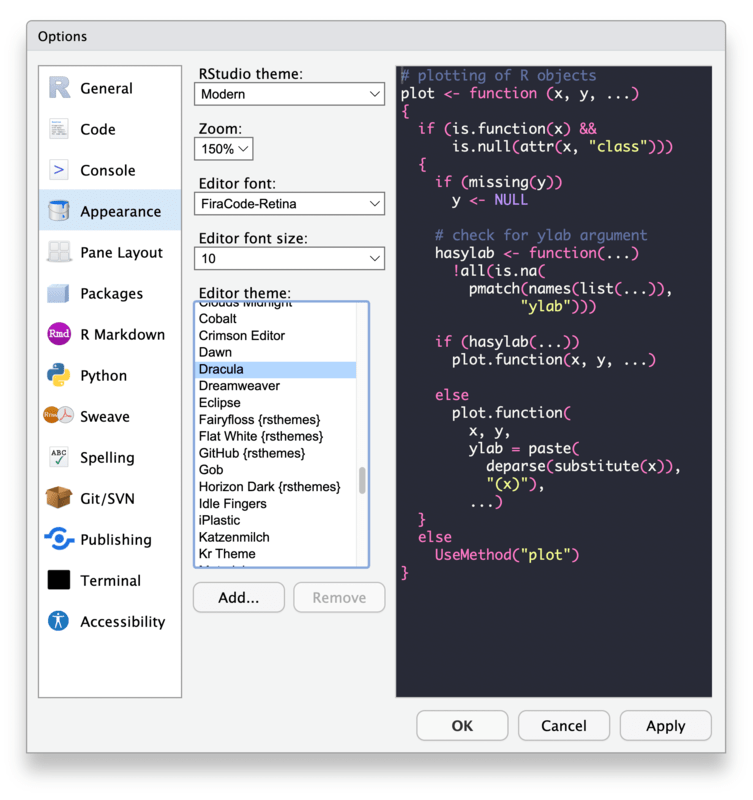

<!-- index.md is generated from index.qmd. Please edit that file -->

# rstudiothemes <a href="https://dieghernan.github.io/rstudiothemes/"></a>

<!-- badges: start -->

[](https://CRAN.R-project.org/package=rstudiothemes)
[](https://cran.r-project.org/web/checks/check_results_rstudiothemes.html)
[](https://CRAN.R-project.org/package=rstudiothemes)
[](https://dieghernan.r-universe.dev/rstudiothemes)
[](https://github.com/dieghernan/rstudiothemes/actions/workflows/check-full.yaml)
[](https://app.codecov.io/gh/dieghernan/rstudiothemes)
[](https://coveralls.io/github/dieghernan/rstudiothemes)
[](https://www.codefactor.io/repository/github/dieghernan/rstudiothemes)
[](https://doi.org/10.32614/CRAN.package.rstudiothemes)
[](https://www.repostatus.org/#inactive)

<!-- badges: end -->

Convert **Visual Studio Code**, **Positron** and **TextMate** theme
files to custom **RStudio** themes.

This package provides tools to convert **Visual Studio Code**,
**Positron** and **TextMate** theme files (`.json` and `.tmTheme`
formats) to **RStudio** `.rstheme` files. **RStudio** has supported
custom themes in `.rstheme` format since **RStudio** 1.2. See the
[**RStudio** theme creation
documentation](https://rstudio.github.io/rstudio-extensions/rstudio-theme-creation.html).

<div class="callout callout-style-default callout-note callout-titled">
<div class="callout-header d-flex align-content-center">
<div class="callout-icon-container"><i class="callout-icon"></i></div>
<div class="callout-title-container flex-fill">Note</div></div>
<div class="callout-body-container callout-body">

This package is stable and maintained on a best-effort basis. I
currently prioritize **CRAN** compatibility and bug and regression fixes
over new features.

</div>
</div>

## Features

- Convert **Visual Studio Code**, **Positron** and **TextMate** theme
  files to **RStudio** `.rstheme` files.
- Convert themes bidirectionally between **TextMate** and **Visual
  Studio Code** or **Positron** formats.
- Install bundled ports of popular **Visual Studio Code** and
  **Positron** themes that are ready to use in **RStudio**.
- List, preview and remove bundled **RStudio** themes.
- Read theme files as tabular data for inspection or conversion
  workflows.

## Bundled themes

This package includes ports of several popular **Visual Studio Code**
and **Positron** themes, ready to use in **RStudio**. Use
`install_rstudiothemes()` to install them in your **RStudio** IDE:

``` r
rstudiothemes::install_rstudiothemes()

#> ✔ Installed 36 themes
#> ℹ Use `rstudiothemes::list_rstudiothemes()` to list installed themes.
#> ℹ Use `rstudiothemes::try_rstudiothemes()` to preview installed themes.

rstudioapi::applyTheme("Winter is Coming Dark Blue")
```

<div class="text-center">



</div>

Available themes include popular choices such as Tokyo Night, Night Owl,
Winter is Coming, SynthWave 84, Nord and many more:

``` r
rstudiothemes::list_rstudiothemes(list_installed = FALSE)
#>  [1] "Andromeda"                  "ayu Dark"                  
#>  [3] "ayu Light"                  "Catppuccin Latte"          
#>  [5] "Catppuccin Mocha"           "cobalt2"                   
#>  [7] "CRAN"                       "Dracula2025"               
#>  [9] "GitHub Dark"                "GitHub Light"              
#> [11] "JellyFish Theme"            "Matcha"                    
#> [13] "Matrix"                     "Night Owl"                 
#> [15] "Night Owl Light"            "Nord"                      
#> [17] "OKSolar Dark"               "OKSolar Light"             
#> [19] "OKSolar Sky"                "One Dark Pro"              
#> [21] "Overflow Dark"              "Overflow Light"            
#> [23] "Panda Syntax"               "Positron Dark"             
#> [25] "Positron Light"             "Selenized Dark"            
#> [27] "Selenized Light"            "Skeletor Syntax"           
#> [29] "SynthWave 84"               "Tokyo Night"               
#> [31] "Tokyo Night Light"          "Tokyo Night Storm"         
#> [33] "VSCode Dark"                "VSCode Light"              
#> [35] "Winter is Coming Dark Blue" "Winter is Coming Light"
```

The bundled themes are also distributed in a single `.zip` file at
<https://dieghernan.github.io/rstudiothemes/dist/rstudiothemes.zip>.
Unzip the file and install the themes using the [**RStudio** IDE
interface](https://docs.posit.co/ide/user/ide/guide/ui/appearance.html).

## Installation

<div class="pkgdown-release">

Install **rstudiothemes** from
[**CRAN**](https://CRAN.R-project.org/package=rstudiothemes):

``` r
install.packages("rstudiothemes")
```

</div>

<div class="pkgdown-devel">

Read the documentation for the development version at
<https://dieghernan.github.io/rstudiothemes/dev/>.

You can install the development version of **rstudiothemes** with:

``` r
# install.packages("pak")
pak::pak("dieghernan/rstudiothemes")
```

Alternatively, you can install **rstudiothemes** using
[**r-universe**](https://dieghernan.r-universe.dev/rstudiothemes):

``` r
# Install rstudiothemes in R:
install.packages(
  "rstudiothemes",
  repos = c(
    "https://dieghernan.r-universe.dev",
    "https://cloud.r-project.org"
  )
)
```

</div>

## Try the online converter

The online **Shiny** app includes the main **rstudiothemes** conversion
features and lets you convert theme files in your browser:

<https://dieghernan-themeconverter.share.connect.posit.cloud/>

## Converting an existing theme

You can convert any **Visual Studio Code**, **Positron** or **TextMate**
theme file to an **RStudio** `.rstheme` file with this workflow:

1.  Start with a **Visual Studio Code**, **Positron** or **TextMate**
    theme file or a URL to an online theme.
2.  Use `convert_to_rstudio_theme()` to convert and install it:

``` r
rstudiothemes::convert_to_rstudio_theme(
  "<path/to/file>",
  apply = TRUE,
  force = TRUE
)
```

Alternatively, in **RStudio**, choose
`Tools > Global Options > Appearance > Add` and select the installed
theme.

<div class="text-center">



</div>

### Convert between theme formats

The package also provides `convert_vs_to_tm_theme()` and
`convert_tm_to_vs_theme()` for conversion between **Visual Studio
Code**, **Positron** and **TextMate** formats.

## Creating themes from scratch

**rstudiothemes** does not provide a built-in theme editor. To create
themes from scratch, use one of these tools and then convert the result:

- **TextMate** `.tmTheme`: Use <https://tmtheme-editor.linuxbox.ninja/>.
  See also the official **RStudio** documentation on [creating
  themes](https://rstudio.github.io/rstudio-extensions/rstudio-theme-creation.html).
- **Visual Studio Code** `.json`: See the official **Visual Studio
  Code** documentation on [creating color
  themes](https://code.visualstudio.com/api/extension-guides/color-theme).

## Contributing

Contributions are welcome. To contribute:

1.  Open an issue to discuss your ideas or proposed changes.
2.  Fork the repository and create a feature branch.
3.  Submit a pull request with clear commit messages and descriptions.

## Citation

<p>

Hernangómez D (2026). <em>rstudiothemes: Create and Install Custom
RStudio Themes</em>.
<a href="https://doi.org/10.32614/CRAN.package.rstudiothemes">doi:10.32614/CRAN.package.rstudiothemes</a>.
<a href="https://dieghernan.github.io/rstudiothemes/">https://dieghernan.github.io/rstudiothemes/</a>.
</p>

A **BibTeX** entry for **LaTeX** users:

    @Manual{R-rstudiothemes,
      title = {{rstudiothemes}: Create and Install Custom {RStudio} Themes},
      doi = {10.32614/CRAN.package.rstudiothemes},
      author = {Diego Hernangómez},
      year = {2026},
      version = {1.1.2.9000},
      url = {https://dieghernan.github.io/rstudiothemes/},
      abstract = {Create, convert and install custom RStudio editor themes from Visual Studio Code, Positron and TextMate theme files. Convert themes between TextMate, Visual Studio Code and Positron formats and install bundled ports of popular themes for use in RStudio.},
    }
