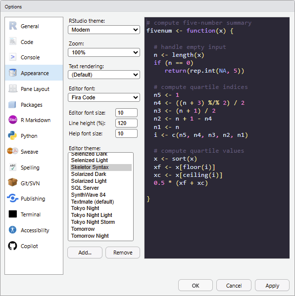
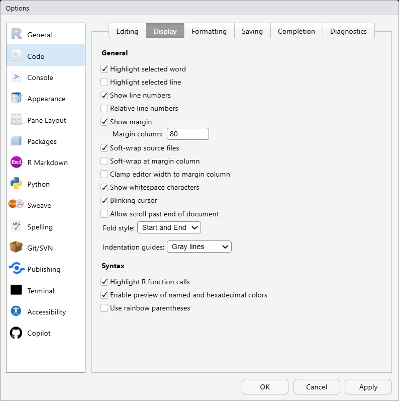

This article previews bundled **RStudio** themes from **rstudiothemes**.

Install the bundled themes with:

```{r}
#| label: demo
#| eval: false

rstudiothemes::install_rstudiothemes()
```

The bundled themes are also distributed in a single `.zip` file:
[dist/rstudiothemes.zip](https://dieghernan.github.io/rstudiothemes/dist/rstudiothemes.zip).
Unzip the file and install the themes using the [**RStudio** IDE
interface](https://docs.posit.co/ide/user/ide/guide/ui/appearance.html).

In **RStudio**, choose `Tools > Global Options > Appearance > Add`.

::: {#fig-ui}
{.nolightbox fig-alt="RStudio Add Theme interface"
width="80%"}

**RStudio** Add Theme interface.
:::

## Lightbox gallery

Click an image to enlarge it.

```{r}
#| label: setup
#| echo: false

library(rstudiothemes)

themes <- sort(list_rstudiothemes(list_installed = FALSE))
png_name <- paste0(gsub(" ", "", tolower(themes), fixed = TRUE))
pths <- file.path("screenshots", paste0(png_name, ".png"))
```

::: {.row .row-cols-1 .row-cols-sm-2 .g-1}
```{r}
#| label: card_layout
#| echo: false
#| output: asis

for (i in seq_along(themes)) {
  cat("<div class=\"col\">")
  cat("<div class=\"card bg-dark text-white\">")
  cat(paste0(
    "{ .lightbox .card-img ",
    "group=\"rstudiothemes\" description=\"",
    themes[i],
    "\" alt=\"",
    themes[i],
    "\" }"
  ))
  cat("<div class=\"card-img-overlay bottom-100\">")
  cat(c(paste0("<p class=\"like_h\">", themes[i], "</p>")))
  cat("</div>")
  cat("</div>")
  cat("</div>")
}
```
:::

```{=html}
<div class="callout callout-style-default callout-note callout-titled">
<div class="callout-header d-flex align-content-center">
<div class="callout-icon-container"><i class="callout-icon"></i></div>
<div class="callout-title-container flex-fill">About the screenshots</div>
</div>
<div class="callout-body-container callout-body">
```

Previews may look different on your device. The screenshots use this setup:

**RStudio** version

```         
RStudio 2026.08.1+195 "Yellow Yarrow" 

Release (8d474bc4cfad0e317095cd171e8ef44db6887068, 2026-08-14) for windows
Mozilla/5.0 (Windows NT 10.0; Win64; x64) AppleWebKit/537.36 (KHTML, like Gecko)
RStudio/2026.08.1+195 
Chrome/148.0.7778.280 
Electron/42.7.1 
Safari/537.36, 
Quarto 1.10.18 (C:/Users/diego/AppData/Local/Programs/Quarto/bin/quarto.exe)
```

**Code font**

Fira Code: <https://fonts.google.com/specimen/Fira+Code>.

::: {#fig-opts}
{.nolightbox fig-alt="RStudio Options for Screenshots"
width="80%"}

**RStudio** options used for screenshots.
:::

```{=html}
</div>
</div>
```
